# LEGO Contribution Garden

<p align="center">
  
</p>

GitHub 잔디를 **레고 미니피규어가 직접 가꾸는 정원**으로 만들어줍니다.

밀짚모자를 쓴 레고가 빈 밭을 걸어가며 씨앗을 뿌리고, 물을 주고, 잔디가 자라나는 애니메이션 SVG를 생성합니다.

> 토큰 없이도 동작합니다. `github.repository_owner`를 사용하므로 **별도 설정 없이 본인 계정으로 자동 세팅**됩니다.

---

## 사용법

### Step 1. 워크플로우 파일 추가

본인 레포에 `.github/workflows/lego-garden.yml` 파일을 생성하고 아래 내용을 복사합니다:

```yaml
name: Generate LEGO Garden

on:
  schedule:
    - cron: "0 */6 * * *" # 6시간마다 자동 업데이트
  workflow_dispatch:       # Actions 탭에서 수동 실행 가능
  push:
    branches: [main]

permissions:
  contents: write

jobs:
  generate:
    runs-on: ubuntu-latest
    steps:
      - uses: actions/checkout@v4

      - uses: actions/setup-node@v4
        with:
          node-version: "20"

      - run: npm ci
      - run: npm run build

      - name: Generate LEGO Garden
        env:
          # 자동으로 본인 계정으로 설정됩니다
          GITHUB_USERNAME: ${{ github.repository_owner }}
        run: node dist/index.js

      - name: Commit
        run: |
          git config --local user.email "action@github.com"
          git config --local user.name "LEGO Garden Bot"
          git add output/
          if git diff --staged --quiet; then
            echo "No changes to commit"
          else
            git commit -m "chore: update LEGO garden"
            git push
          fi
```

> `${{ github.repository_owner }}`는 레포 소유자의 username으로 자동 치환됩니다. 직접 입력할 필요 없습니다.

### Step 2. 워크플로우 실행

- **자동**: `main` 브랜치에 push하면 자동 실행됩니다
- **수동**: `Actions` 탭 > `Generate LEGO Garden` > `Run workflow` 클릭

실행이 완료되면 `output/lego-garden.svg` 파일이 생성(커밋)됩니다.

### Step 3. README에 이미지 추가

본인 `README.md`에 아래 한 줄을 추가합니다:

```markdown

```

끝입니다! 6시간마다 자동으로 업데이트됩니다.

---

## 동작 방식

| 단계 | 설명 |
|------|------|
| 상단 | GitHub contribution 그래프가 배경으로 표시됩니다 |
| 빈 밭 | 하단에 흙으로 된 빈 밭이 그려집니다 |
| 씨앗 | 레고가 걸어가며 왼손 씨앗봉지에서 씨앗을 뿌립니다 |
| 물 | 오른손 물뿌리개에서 물이 뿌려집니다 |
| 성장 | contribution 레벨에 따라 잔디가 자라납니다 |

| 레벨 | 활동량 | 결과 |
|------|--------|------|
| 0    | 없음   | 빈 흙 |
| 1    | 적음   | 짧은 새싹 |
| 2    | 보통   | 중간 잔디 |
| 3    | 많음   | 큰 잔디 + 잎 + 덤불 |
| 4    | 최대   | 가장 큰 잔디 + 꽃 |

---

## 커스터마이징

### 색상 변경

워크플로우의 `env`에 원하는 색상을 추가하면 됩니다:

```yaml
- name: Generate LEGO Garden
  env:
    GITHUB_USERNAME: ${{ github.repository_owner }}
    LEGO_COLOR: "#FF6B6B"    # 레고 몸통 색상 (기본: #FFD700 골드)
    WATER_COLOR: "#a29bfe"   # 물방울 색상 (기본: #56c4f5 하늘색)
    BG_COLOR: "#f8f9fa"      # 배경 색상 (기본: #ffffff 흰색)
    GARDEN_WEEKS: "30"       # 정원에 표시할 주 수 (기본: 20, 범위: 4~52)
    OUTPUT_DIR: "assets"     # 출력 디렉토리 (기본: 루트)
    OUTPUT_FILE: "my-garden.svg"  # 출력 파일명 (기본: lego-garden.svg)
  run: node dist/index.js
```

| 환경 변수 | 설명 | 기본값 |
|-----------|------|--------|
| `GITHUB_USERNAME` | GitHub 사용자명 | `${{ github.repository_owner }}` (자동) |
| `GITHUB_TOKEN` | GitHub 토큰 (선택) | - |
| `LEGO_COLOR` | 레고 몸통 색상 | `#FFD700` |
| `WATER_COLOR` | 물방울 색상 | `#56c4f5` |
| `BG_COLOR` | 배경 색상 | `#ffffff` |
| `GARDEN_WEEKS` | 정원에 표시할 주 수 (4~52) | `20` |
| `OUTPUT_DIR` | 출력 디렉토리 (자동 생성) | `output` |
| `OUTPUT_FILE` | 출력 파일명 | `lego-garden.svg` |

### GitHub Token (선택)

토큰 없이도 동작합니다. 더 정확한 contribution 수를 원하면

1. [Personal Access Token](https://github.com/settings/tokens/new) 생성 (`read:user` 스코프)
2. 레포 `Settings` > `Secrets and variables` > `Actions` > `New repository secret`
3. Name: `GH_TOKEN`, Value: 생성한 토큰
4. 워크플로우 env에 한 줄 추가:

```yaml
env:
  GITHUB_USERNAME: ${{ github.repository_owner }}
  GITHUB_TOKEN: ${{ secrets.GH_TOKEN }}
```

---

## 로컬에서 미리보기

```bash
npm install && npm run build

# Mock 데이터로 미리보기 → output/lego-garden-preview.svg
npm run generate:preview

# 실제 유저 데이터 (토큰 불필요) → output/lego-garden.svg
GITHUB_USERNAME=eottabom npm start
```
