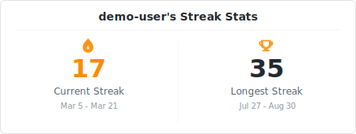
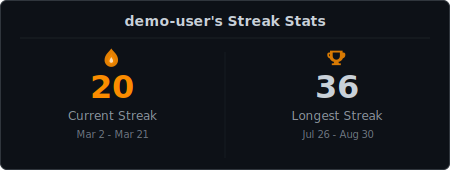
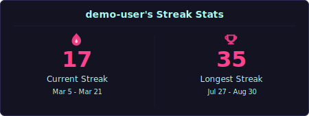
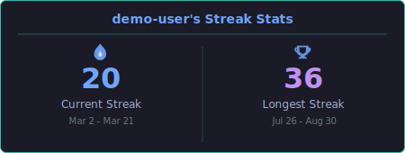
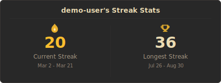

# GitHub Streak Stats

<p align="center">
  
</p>

GitHub 연속 활동(스트릭)을 **깔끔한 카드**로 보여줍니다.

현재 스트릭과 최장 스트릭을 한눈에 확인할 수 있는 SVG 카드를 생성합니다.

> 토큰 없이도 동작합니다. `github.repository_owner`를 사용하므로 **별도 설정 없이 본인 계정으로 자동 세팅**됩니다.

---

## 사용법

### Step 1. 워크플로우 파일 추가

본인 레포에 `.github/workflows/streak-stats.yml` 파일을 생성하고 아래 내용을 복사합니다:

```yaml
name: Generate Streak Stats

on:
  schedule:
    - cron: "0 0 * * *"  # 매일 자동 업데이트
  workflow_dispatch:      # Actions 탭에서 수동 실행 가능

permissions:
  contents: write

jobs:
  generate:
    runs-on: ubuntu-latest
    steps:
      - uses: actions/checkout@v4

      - uses: eottabom/readme-playground/streak-stats@v1.0.0
        with:
          github_username: ${{ github.repository_owner }}
          github_token: ${{ secrets.GITHUB_TOKEN }}

      - name: Commit
        run: |
          git config user.name "github-actions[bot]"
          git config user.email "github-actions[bot]@users.noreply.github.com"
          git add output/
          if git diff --staged --quiet; then
            echo "No changes to commit"
          else
            git commit -m "chore: update streak stats"
            git pull --rebase origin main
            git push
          fi
```

### Step 2. 워크플로우 실행

- **수동**: `Actions` 탭 > `Generate Streak Stats` > `Run workflow` 클릭
- **자동**: 매일 UTC 00:00에 자동 실행됩니다

실행이 완료되면 `output/streak-stats.svg` 파일이 생성(커밋)됩니다.

### Step 3. README에 이미지 추가

본인 `README.md`에 아래 한 줄을 추가합니다:

```markdown

```

---

## 테마

5가지 내장 테마를 지원합니다:

### `default`

<p align="center">
  
</p>

### `dark`

<p align="center">
  
</p>

### `radical`

<p align="center">
  
</p>

### `tokyonight`

<p align="center">
  
</p>

### `gruvbox`

<p align="center">
  
</p>

```yaml
- uses: eottabom/readme-playground/streak-stats@v1.0.0
  with:
    github_username: ${{ github.repository_owner }}
    github_token: ${{ secrets.GITHUB_TOKEN }}
    theme: "dark"
```

---

## 커스터마이징

워크플로우의 `with`에 원하는 옵션을 추가하면 됩니다:

```yaml
- uses: eottabom/readme-playground/streak-stats@v1.0.0
  with:
    github_username: ${{ github.repository_owner }}
    github_token: ${{ secrets.GITHUB_TOKEN }}
    theme: "dark"
    locale: "ko"
    accent_color: "#ff6b6b"
    hide_title: "true"
    output_dir: "assets"
    output_file: "my-streak.svg"
```

| 옵션 | 설명 | 기본값 |
|------|------|--------|
| `github_username` | GitHub 사용자명 | `${{ github.repository_owner }}` (자동) |
| `github_token` | GitHub 토큰 (선택) | - |
| `theme` | 카드 테마 | `default` |
| `locale` | 날짜 표시 언어 (`en`, `ko`) | `en` |
| `bg_color` | 배경 색상 오버라이드 | - |
| `border_color` | 테두리 색상 | - |
| `title_color` | 타이틀 텍스트 색상 | - |
| `value_color` | 숫자 색상 | - |
| `label_color` | 라벨 텍스트 색상 | - |
| `accent_color` | 액센트 색상 (불꽃 아이콘 등) | - |
| `date_color` | 날짜 범위 텍스트 색상 | - |
| `hide_title` | 타이틀 숨기기 | `false` |
| `output_dir` | 출력 디렉토리 | `output` |
| `output_file` | 출력 파일명 | `streak-stats.svg` |

---

## 로컬에서 미리보기

```bash
npm install && npm run build

# Mock 데이터로 미리보기 (모든 테마) → output/streak-stats-preview*.svg
npm run generate:preview

# 실제 유저 데이터 (토큰 불필요) → output/streak-stats.svg
GITHUB_USERNAME=eottabom npm start
```
